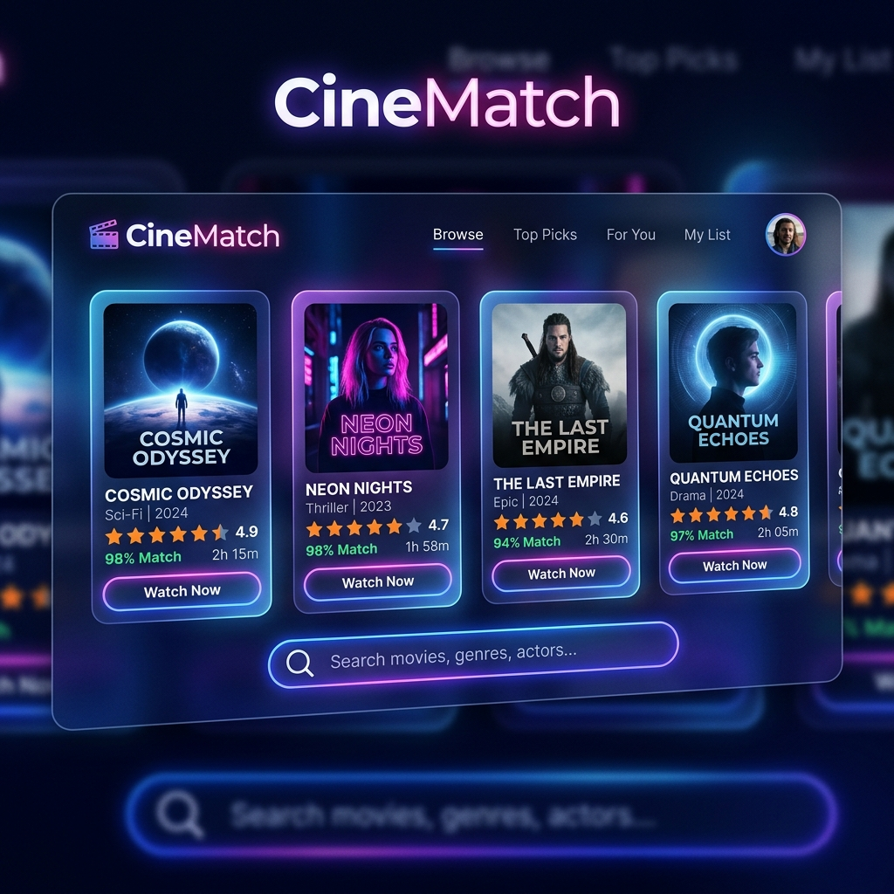

# 🎬 CineMatch - Premium Movie Recommender System



CineMatch is a state-of-the-art, full-stack movie recommendation platform. It combines a robust **FastAPI (Python) backend** implementing a Content-Based Filtering Recommendation Engine with a stunning, highly responsive **HTML/CSS/JS glassmorphic Single Page Application (SPA)**. 

The application supports persistent user profiles, customizable ratings, dynamic watchlists, and features a detailed administrative dashboard for managing movies, user feedback, and TMDB configurations.

---

## ✨ Features

### 🧠 Advanced Content-Based Recommendation Engine
* **Cosine Similarity & TF-IDF Vectors**: Computes high-dimensional movie vectors from attributes like genres (weight: 3.0), directors (weight: 2.0), cast members (weight: 1.5), tags (weight: 2.0), languages, and release years.
* **Personalized Recommendations**: Hybrid filtering model that aggregates user ratings and watchlist preferences to recommend personalized movie lists complete with dynamic `% Match` scores.
* **Instant Rebuilding**: Recomputes similarity matrices instantly in-memory whenever new movies are added or imported.

### 🌟 Sleek Glassmorphic Frontend
* **Visual Excellence**: Modern, harmonious dark-theme-first design using fluid CSS gradients, interactive micro-animations, and glassmorphism.
* **Theme Toggle**: Clean support for both light and dark modes.
* **Interactive Dashboard**: Admin control panel built with Chart.js to visualize database stats, rating distributions, and genre densities.
* **Trailer Player**: Integrated YouTube modal overlay to watch trailers directly inside the application.

### 🔌 TMDB API Integration
* **API Key Configuration**: Dynamically configure and test your TheMovieDB (TMDB) API keys directly from the Admin settings.
* **Bulk Importer**: Scale the database easily by importing hundreds of movies directly from TMDB in a single command.
* **Metadata Scraping**: Automatically imports posters, actors, popularity indicators, trailers, and tags from TMDB.

---

## 🛠️ Tech Stack

* **Backend**: FastAPI, Uvicorn (ASGI Server), SQLite3 (with Serverless /tmp write fallback), SSL / standard libraries.
* **Frontend**: Vanilla HTML5, Vanilla CSS3 (Custom design system variables), Vanilla JS (ES6+ Modules), Chart.js (CDN).
* **Deployment**: Writable SQLite database fallback for Serverless platforms (like Vercel).

---

## 📂 Project Structure

```text
CineMatch-MovieRecommender/
├── api/
│   └── index.py             # Entrypoint for Vercel Serverless deployments
├── backend/
│   ├── main.py              # FastAPI server, REST API endpoints & static serving
│   ├── database.py          # SQLite database schema, seeding, and /tmp copy routing
│   ├── recommender.py       # Content-based ML engine (TF-IDF & Cosine Similarity)
│   ├── tmdb_service.py      # TMDB API integration client
│   ├── bulk_import.py       # Bulk movie importer command-line utility
│   ├── cinematch.db         # Pre-seeded SQLite database file
│   └── requirements.txt     # Python server requirements
├── frontend/
│   ├── index.html           # Main Single Page Application structure
│   ├── css/
│   │   └── style.css        # Clean glassmorphic design system (CSS variables)
│   ├── js/
│   │   ├── state.js         # State management, local caching, and backend API integration
│   │   └── ui.js            # DOM manipulation, event routing, and chart renderers
│   └── data/
│       └── movies.js        # Fallback dataset for offline operation
├── vercel.json              # Vercel deployment routes and serverless rewrites
├── requirements.txt         # Root deployment requirements
├── cinematch_banner.png     # Beautiful visual banner for documentation
└── README.md                # This file
```

---

## 🚀 How to Setup and Run Locally

### 1. Pre-requisites
Make sure you have **Python 3.8+** installed.

### 2. Setup the Backend
1. Clone the repository and navigate to the project directory.
2. Navigate to the `backend` folder:
   ```bash
   cd backend
   ```
3. Install dependencies:
   ```bash
   pip install -r requirements.txt
   ```
4. Run the development server:
   ```bash
   python main.py
   ```
   The backend server will run at: `http://localhost:8000`

### 3. Open the Application
FastAPI serves the static frontend files directly at the root path, so simply open your browser and navigate to:
👉 **[http://localhost:8000](http://localhost:8000)**

---

## ☁️ Deployment on Vercel

CineMatch is pre-configured for seamless serverless deployment on **Vercel** with a built-in read-write database clone mechanism:

1. **Install Vercel CLI** (if not already installed):
   ```bash
   npm install -g vercel
   ```
2. **Deploy to Vercel**:
   Run the following command from the project root:
   ```bash
   vercel
   ```
3. **Configure Environment variables** (Optional):
   Provide your settings in the Vercel dashboard.

---

## 📊 Database Administration

To login to the Admin Dashboard inside the app:
* **Username**: `admin`
* **Password**: `admin123`

### TMDB Bulk Movie Importer
To populate the database with real movies from TMDB:
1. Obtain an API Key from [TheMovieDB](https://www.themoviedb.org/).
2. Log into the CineMatch Admin Panel and save your TMDB API Key under **Settings**.
3. Run the bulk import helper script from the project root:
   ```bash
   python backend/bulk_import.py 100
   ```
   *(Replaces `100` with the number of movies you wish to import).*

---

## 📝 License
This project is open-source and available under the MIT License.
